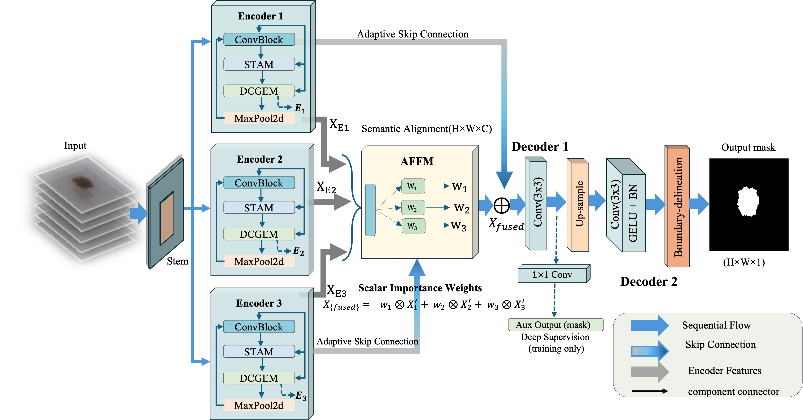

# Resource-Constrained Skin Lesion Segmentation using Efficient Attention Dual-Stream Network

This is the official implementation of **EADS-Net** (Efficient Attention Dual-Stream Network), as presented in the paper:

**"Resource-Constrained Skin Lesion Segmentation using Efficient Attention Dual-Stream Network"**

 **Submitted to:** [Biomedical Signal Processing and Control]

 **Key Highlights:** 2.09M Parameters | 0.0036s Inference Time | Hybrid CNN-Transformer Design

EADS-Net is a lightweight, hybrid architecture designed to bridge the efficiency gap for real-world clinical deployment in resource-limited settings. It achieves high-fidelity segmentation by effectively combining adaptive multi-scale reweighting with explicit boundary refinement.

---

##  Architecture

EADS-Net integrates three core modular innovations to balance precision and speed:

1. **Enhanced Attention Module (EAM):** Implements adaptive multi-scale feature reweighting to focus on salient lesion regions.
2. **Improved Edge Enhancement Module (IEEM):** Provides explicit boundary refinement to capture sharp, accurate lesion edges.
3. **Smart Feature Fusion Module (SFFM):** Optimized for multi-level feature aggregation to ensure a cohesive final segmentation map.


---

## Performance Results

EADS-Net consistently demonstrates superior performance across three standard public benchmarks, maintaining high accuracy with a minimal computational footprint.

### Quantitative Comparison

| Dataset | F1-Score | mIoU | Parameters | Inference Time |
| --- | --- | --- | --- | --- |
| **ISIC-2017** | **TBD*** | **TBD*** | 2.09M | 0.0036s |
| **ISIC-2018** | **TBD*** | **TBD*** | 2.09M | 0.0036s |
| **PH2** | **TBD*** | **TBD*** | 2.09M | 0.0036s |

**Specific dataset metrics can be populated from the manuscript tables.*

### Qualitative Results

EADS-Net is highly effective in terms of intersection-over-union (IoU) and dice similarity, providing clear, well-defined lesion boundaries even in challenging clinical images.

---

## Quick Start

### 1. Requirements

* Python 3.7.5+
* PyTorch 2.2.0
* OpenCV 4.9.0
* NumPy 1.26.4
* SciPy 1.11.4
* Matplotlib 3.8.0

### 2. Experimental Setup

* **Preprocessing:** Standardized input resizing and mask binarization.
* **Optimization:** Utilizes a custom hybrid loss function for boundary precision.

---

## 📁 Dataset Preparation

Place the following public benchmarks in your `data/` directory:

1. **ISIC-2017**: [Download Link](https://challenge.isic-archive.com/data/)
2. **ISIC-2018**: [Download Link](https://challenge.isic-archive.com/data/)
3. **PH2**: [Download Link](https://www.fc.up.pt/addi/ph2%20database.html)

---

## Training & Evaluation

To train and evaluate the EADS-Net model:

```bash
# Example training command
python train.py --dataset ISIC2018 --epochs 100 --batch_size 16

```


---

## ✉️ Contact

**Razan Alharith** (Southwest Jiaotong University)

Email: [razanalharith@my.swjtu.edu.cn](mailto:razanalharith@my.swjtu.edu.cn)
